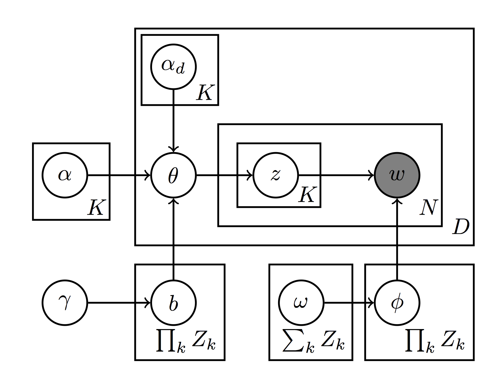

# Research Project CMSC828P - Extracting signatures using f-LDA

**Author**: Qingyang Tan ([qytan@cs.umd.edu](mailto:qytan@cs.umd.edu))
**Date**: December 6, 2018

## Plan of investigation

Some factors like smoking history, age, gender would impact the mutation processes in cancer, as shown in Alexandrov, et al. [1]. We want to use facotrial LDA (f-LDA) to extract mutation signatures, hoping the model could consider the impact of these factors. Paul, et al. [2]. Meanwhile, after training f-LDA, we can directly infer the influences of different factors over mutation signatures from the results. In the following section, we will give more details about f-LDA, data we used and planned experiments.

### Factorial LDA (f-LDA) overview

According to Paul, et al. [2], factorial LDA is a multi-dimensional model in which a document is influenced by K different factors, and each word token depends on a K-dimensional vector of latent variables. Here is a figure shown f-LDA as a graphical model:

Since f-LDA has several different factors (i.e. [Z1, Z2, Z3, Z4, ..., Z5), we can consider different factors as base signatures, smoker vs non-smoker, alcohol user vs non-alcohol user, female vs male and so on. Notice that, f-LDA is pure unsupervised learning, thus we need to check the meaning of different factors manually after training. 

#### Experiment

#### Data, resources, and implementation

#### Validation

## Results

## References
1. Alexandrov, et al. (2016) "Mutational signatures associated with tobacco smoking in human cancer." _Science_ 354(6312), pages 618-622. [doi: 10.1126/science.aag0299](https://doi.org/10.1126/science.aag0299)
2. Paul, et al. (2012) "Factorial LDA: Sparse Multi-Dimensional Text Models" _NIPS_